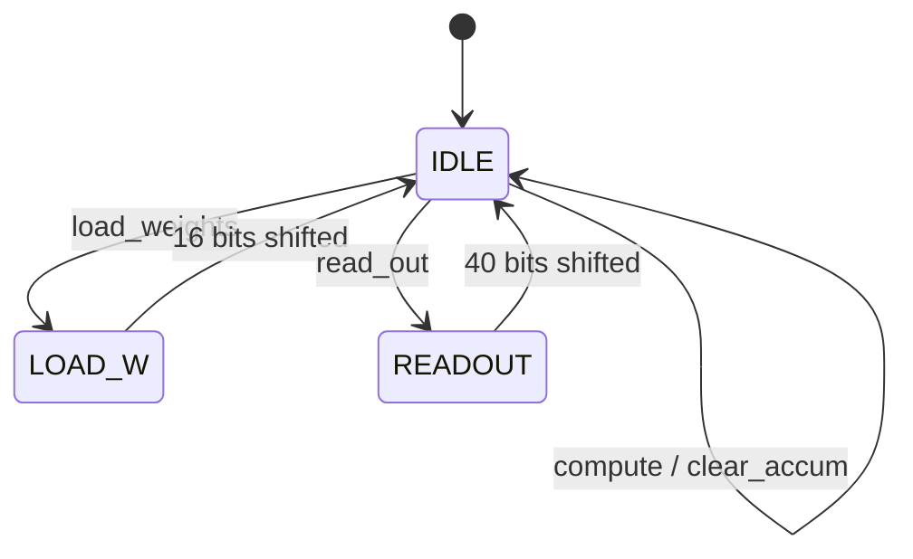
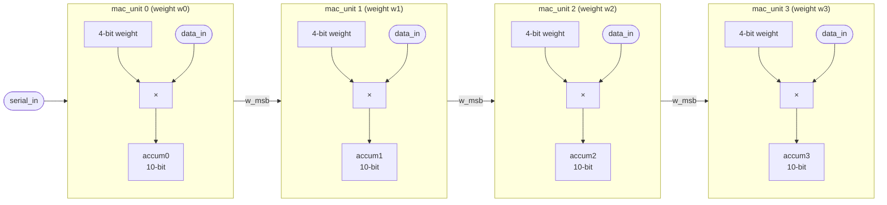
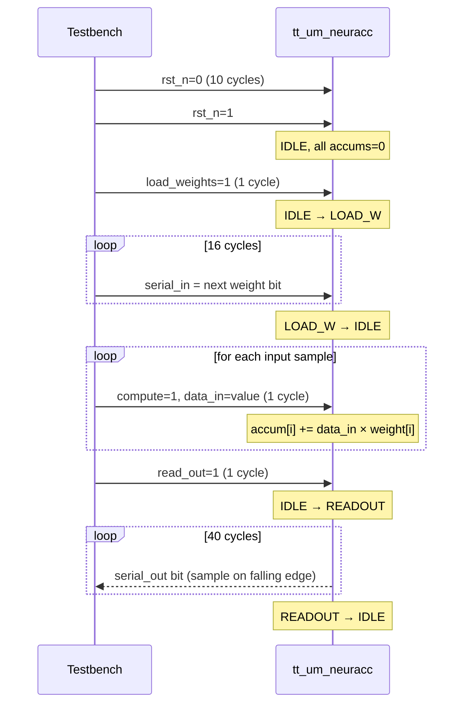

   

# NeurAcc — Neural Network MAC Accelerator

NeurAcc is a 4-element weight-stationary MAC (Multiply-Accumulate) accelerator for neural network inference, built as a systolic array on a single Tiny Tapeout tile.

- 4 parallel MAC units, each with a 4-bit weight and a 10-bit accumulator
- Weights loaded serially (16 bits: 4 units × 4-bit, MSB-first)
- 8-bit input applied to all 4 units simultaneously on each compute pulse
- Results read out serially (40 bits: 4 units × 10-bit, MSB-first)
- Simple 3-state FSM: `IDLE` → `LOAD_W` → `IDLE` → `READOUT`

## How it works

The top-level module (`tt_um_neuracc`) contains a 3-state FSM and instantiates `mac_array`, which chains 4 `mac_unit` instances. Each `mac_unit` holds a 4-bit weight register and a 10-bit accumulator. On every `compute` pulse, all units simultaneously compute `accum += data_in × weight`.

**FSM**



**Systolic array**



**Pin summary**

| Pin | Function |
|-----|----------|
| `ui_in[0]` | `serial_in` — weight bit during LOAD_W |
| `ui_in[1]` | `load_weights` — pulse to start loading weights |
| `ui_in[2]` | `compute` — pulse to accumulate one input |
| `ui_in[3]` | `read_out` — pulse to start serial readout |
| `ui_in[4]` | `clear_accum` — pulse to zero all accumulators |
| `uio_in[7:0]` | `data_in` — 8-bit input vector |
| `uo_out[0]` | `serial_out` — result bit stream |
| `uo_out[1]` | `ready` — high when FSM is idle |

## Quick start

1. Reset (`rst_n` low for 2+ cycles, then release)
2. Load weights: pulse `load_weights`, then shift in 16 bits on `serial_in`
3. Compute: for each input sample, put value on `uio_in` and pulse `compute`
4. Read: pulse `read_out`, then sample `uo_out[0]` for 40 cycles

**Operation sequence**



**Example** — weights `[1,2,3,4]`, inputs `[10,20,30]`:
```
accum0 = 60   accum1 = 120   accum2 = 180   accum3 = 240
```

See [docs/info.md](docs/info.md) for the full protocol and timing details.

## What is Tiny Tapeout?

Tiny Tapeout is an educational project that makes it easier and cheaper than ever to get your digital designs manufactured on a real chip. Visit https://tinytapeout.com to learn more.

## Resources

- [Project documentation](docs/info.md)
- [FAQ](https://tinytapeout.com/faq/)
- [Digital design lessons](https://tinytapeout.com/digital_design/)
- [Join the community](https://tinytapeout.com/discord)
